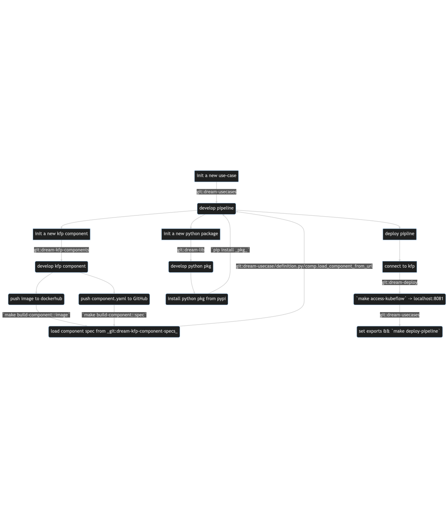

KFP Development Lifecycle
==========================

Basic lifecycle of development, pipelines should be kept lightweight, with emphasis on repeatability through developing *libs* and *components*.

`(source) <https://mermaid.live/edit#pako:eNqFVE2PmzAQ_SsjDqtEWrLtbcWhhySojZQmSNu0qkJFHHsSLIxtYdMt2ux_XxsS8qFdlRN43rw3M2_MS0AVwyAKdkI905xUFn5MUwnuWcS_VpM1l9wCAYnPUBsMKTH4B8Lwy2HPbcQqJGXozv2xOcA0_pnMkng-W8QDhn9RKA2aaxRc4rBjvYB4Gq8yWX5PPgzOZ-P3Y9M4mS9_n47WDLVQjVfzYm2JMFkuFqnsu_E6l_0UOw1UlVpJlPa2KRcM-2DXms_v27pKPvfmMa32eDWbT9sMXZsceEn2CFYBU7TAKq-3w1ZwU5ICYVtzwc5yUdTCN4dkNb4aTs9-DDwl8aTj73NHDSmFF_rK7bf_qBiN9Ebk-DEQirAzKXgk7CpVQvbBiEIPMdnw_d14YLjzk-dKjnTz4LNGXiLr8zPPntWVOFwY7c3r7XObcOmebmyuJGhCCzerW_sE37aeuaTzJh4ziv3ZLxc_DdRDuTSWCHEB7brWjebHUboNgxMsc4Bsc12x4-3Y_fatqZISqfWGuHHdVtkt7aGFhuNBZxOhFI0Ji3qL_lJuwJUnFCUiV8ZGj58ePw8_uoAtz2Rg0AL-06qyBu7uoKPttMLTddy4GQT3QYlVSThzP4AXX3Ua2BxLTIPIvTJSFWmQyleHI7VVT42kQWSrGu-DWjNiccrJviJlEO2IMPj6BiEPbuA>`_
